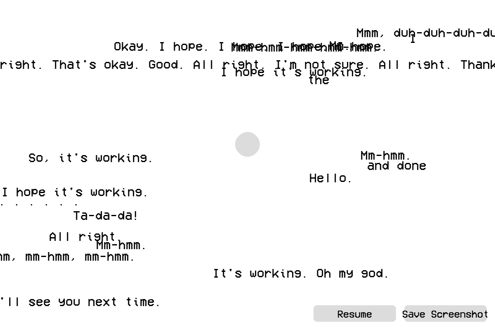
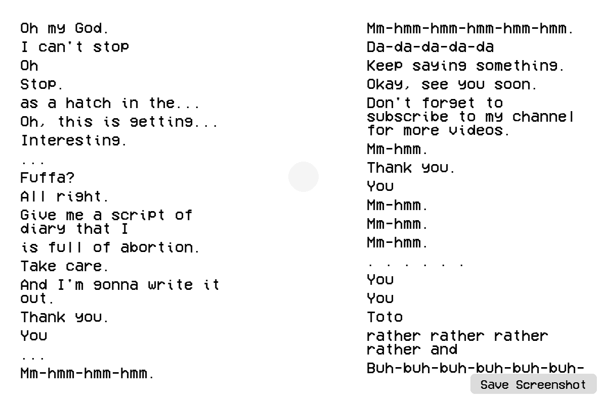
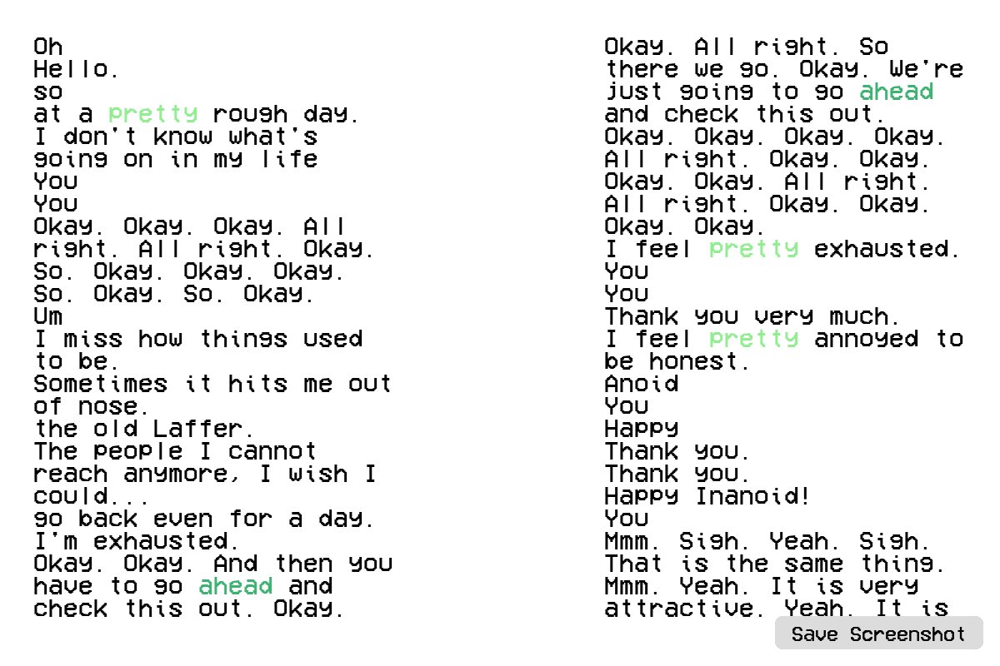

# SD5913 Assignment 3 (2025.10.26)- The Echo Journal
Echo Journal is a small interactive project about emotional release through voice. When we’re stressed, we often need a way to let things out — to unload all the thoughts spinning in our heads. Some people write, some draw, and some just talk it out, and I do all of those LOL. This project recreates that feeling of offloading emotions by turning your spoken words into a visual diary.

When you start recording, a small black pixel figure sits quietly on the screen. As you keep speaking, your words appear around the figure like floating thoughts. The more you talk, the lighter the figure becomes — slowly turning white as if the weight of your emotions is lifting off. Over time, the scene fills with your words, and the figure looks calmer and more at peace.

The goal is simple: to make your emotions visible, and to remind you that speaking them out — even just to yourself — can bring a little lightness back.

# Demo Video

# Inspiration
Inspired by the anime Mushishi season 1 episode 20, a sea of writings/A sea of ink, where the protagonist needs to constantly write so that the ink worm possessed by her family through generations would disappear. When I am very stressed, I tend to write everything down, non-stop, basically just throw whatever comes to my mind out, and clear my mind. I find that sometimes talking out helps, but often it is not written down, so you cannot see where the thoughts are coming from after you speak them out. This mini-program aims to use speech-to-text technology to recreate this experience. I also make the user to be able to save the visual that they created with their input.

# Screenshot Snippets. 

  
  
  

# Envisioned visual effects (my old diaries)

  
  
  

# Major Challenges & Future Implementation Attempts
I personally really like this idea, and I want to make a really fun project out of it. However, it has been a pain in the ass trying to set up different packages for speech-to-text and emotional analysis functions. Setting up a virtual environment, getting the right version for
each library, CUPA not working on GPU but on CPU instead, the packages do not fit the purpose, so on and so on. 

At the end of the day, I do not have time to enhance the visuals and achieve my ultimate vision, but I am planning to refine it as I go. 

1) Emotional Analysis could be enhanced. It does not detect obviously joyful words like 'happy' or negative words like 'exhausted'. I need to check the emotional grouping within the NRCLex libraries
2) Processing takes some time for each sentence I speak, and it does not detect some words but throws gibberish at me. I think it's a result of CPU processing.
3) Refine the visuals, but this is towards later steps. 

# Required Packages & Libraries
`Faster Whisper` - Speech-to-Text transcription
    ``pip install faster-whisper[gpu] sounddevice numpy torch``
`NRCLex` - Text emotional analysis
    download NRCLex dataset: ``python -m textblob.download_corpora``
