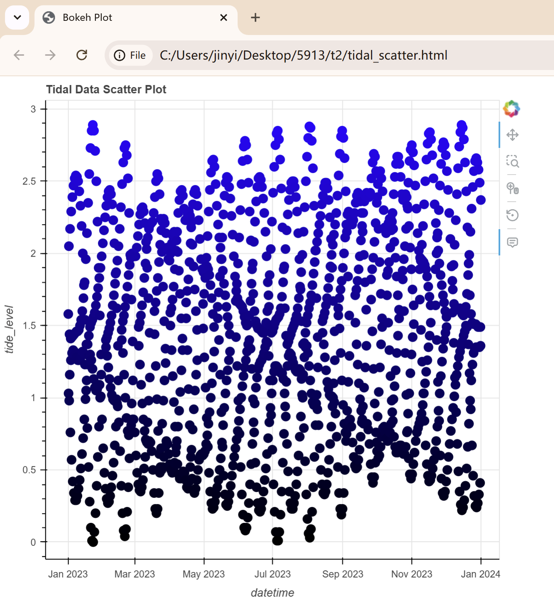
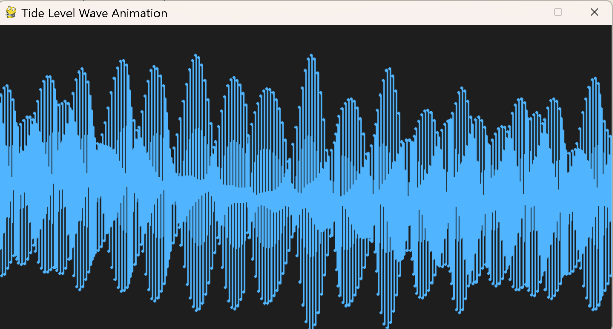

Exercise for SD5913 Tutorial 2.

Includes code for

1) An interactive bokeh scatter plot visualization >> bokeh.py
    
2) A wave pygame animation >> wave_animation.py
    

Both generated based on the "tide-processed.csv" from week2 class material. 

